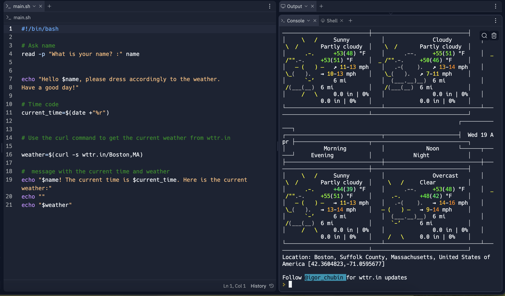

# Wttr.In 
### This script is a derivative of the wttr.in script from __Igor Chubin__ using #!/bin/bash. 

__I went and made my own changes prompting the script to ask a name and then display a message following the weather in the located area.__

#!/bin/bash
# Ask name
read -p "What is your name? :" name

echo "Hello $name, please dress accordingly to the weather. 
Have a good day!"

# Time code
current_time=$(date +"%r")

# Use the curl command to get the current weather from wttr.in

weather=$(curl -s wttr.in/Boston,MA)

#  message with the current time and weather
echo "$name! The current time is $current_time. Here is the current weather:"
echo ""
echo "$weather"

`Website https://wttr.in/
`